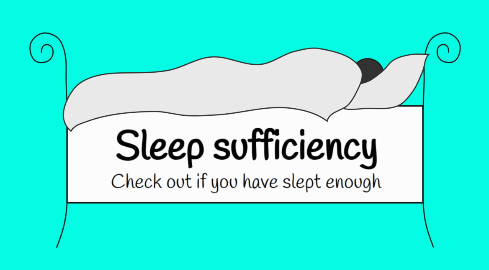

# sleep-sufficiency
This is a small project for practicing JS. 
Enter your age and the number of hours you have slept last night and check out whether this was long enough.
You can try it here: [dorotapindur.github.io/sleep-sufficiency/](https://dorotapindur.github.io/sleep-sufficiency/).

